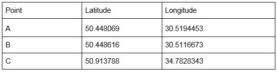

# Dokka.AI

In order to run the app, one will need to:
1. Access a virual environment inside a consol, such as Anaconda Prompt. 
2. cd to the directory of the app, for example "G:\Python\Dokka.AI"
3. Write "python App.py"
Once done that - a window in the browser will pop up with the address http://127.0.0.1:5000/ . This means the App is initialized. 

4. Upload a CSV file of the form : 

Once it's done there will be conducted a download of the file inside the "\Dokka.AI\uploads" folder for the application usage.
5. The app automatically delivers the processed result to the user into "\Dokka.AI\downloads".
