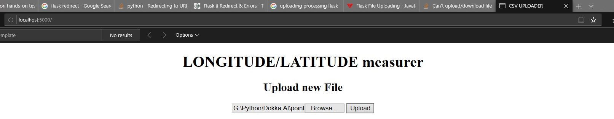

# Dokka.AI

In order to run the app, one will have to:
1. Access a virual environment inside a shell, such as Anaconda Prompt and other command-line tools. 
2. navigate (cd) to the directory of the app, for example "cd G:\Python\Dokka.AI"
3. Write "python App.py".
Once done that - a window in the browser will pop up with the address http://127.0.0.1:5000/ . This means the App is initialized. 

4. Upload a CSV file of the form (there's such file for testing - "points.csv"): 

5. Receive a window with JSON format result. Also, the app automatically delivers the processed result to the user into "\Dokka.AI\work" with the name of the original file.

